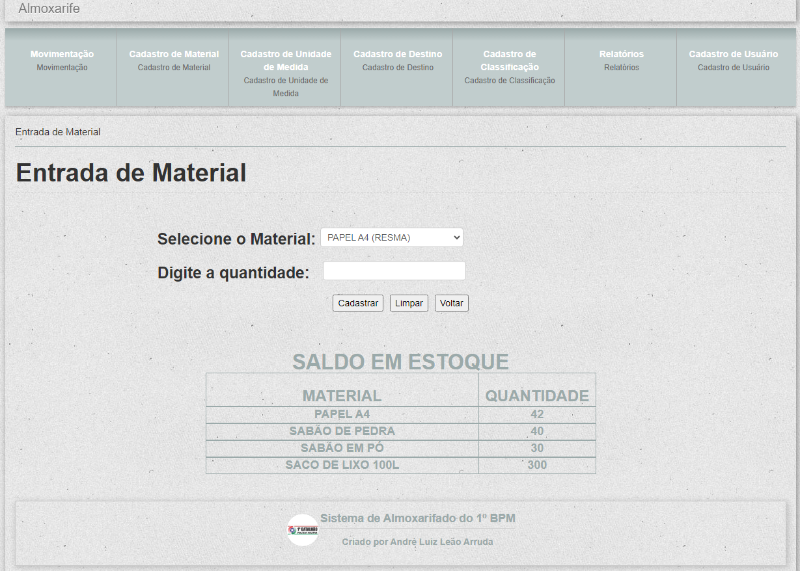

# 
 CONTROLE DE PRODUTOS DO 1º BATALHÃO DE POLÍCIA MILITAR 

  ## Este sistema, desenvolvido em PHP com MySql, consiste em registrar as entradas e saídas de mercadorias para fins de controle. 
 

### Esta é a tela principal.   O sistema é relativamente simples e tem as opções de cadastros de classificação, de destino, de unidade de medida, de material e de usuários, além dos Relatórios. Para cadastrar o material, é preciso cadastrar antes a unidade de medida e a classificação, caso ainda não tenham sido cadastrados. E na opção Movimentação, fazem-se as entradas e saídas das mercadorias.</h3>

### Clicando em Movimentação, submenu Entrada, o usuário seleciona o produto que deseja cadastrar e na segunda caixa de texto ele digita a quantidade do produto escolhido.
    Neste campo existe uma máscara que permite a digitação apenas de números.
### Abaixo da opção de cadastro, já aparecem os produtos "disponíveis".   Isto é feito através de uma consulta ao banco de dados onde, além de somar os produtos (entrada menos saída), ele exibe apenas os produtos com saldo acima de "zero". Veja como o comando foi feito:
    SELECT produtos.descricao AS 'descricao', sum(estoque.quantidade) AS 'saldo' FROM estoque, produtos 
    WHERE (produtos.cod_produto=estoque.cod_produto) 
    GROUP BY descricao HAVING sum(estoque.quantidade) > '0'
    
### Este comando, se usado sem a opção *"GROUP BY"*, vai somar todos os produtos em um único valor.   E a opção *"HAVING sum(estoque.quantidade) > '0'"* é usada para ocultar os produtos que não têm no estoque.

### Caso o produto ainda não esteja cadastrado, o usuário precisa clicar na opção Cadastro de Material. Abaixo da opção de cadastro, aparecem os produtos já cadastrados.   As opções de Unidade de Medida e Classificação são, também, previamente cadastrados, sendo assim, caso não apareçam na caixa dropdown, basta clicar nos botões Cadastro de Unidade de Medida e Cadastro de Classificação, respectivamente.   Naquelas telas aparecerão as opções já cadastradas.
