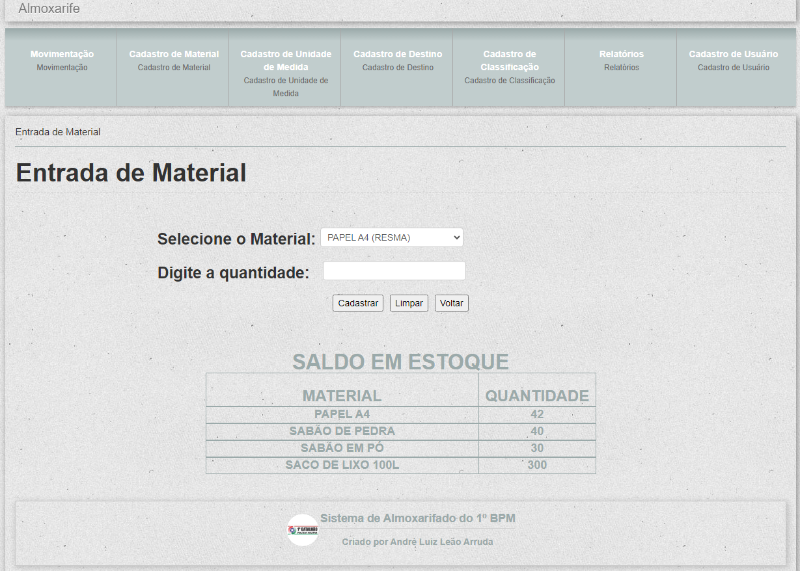
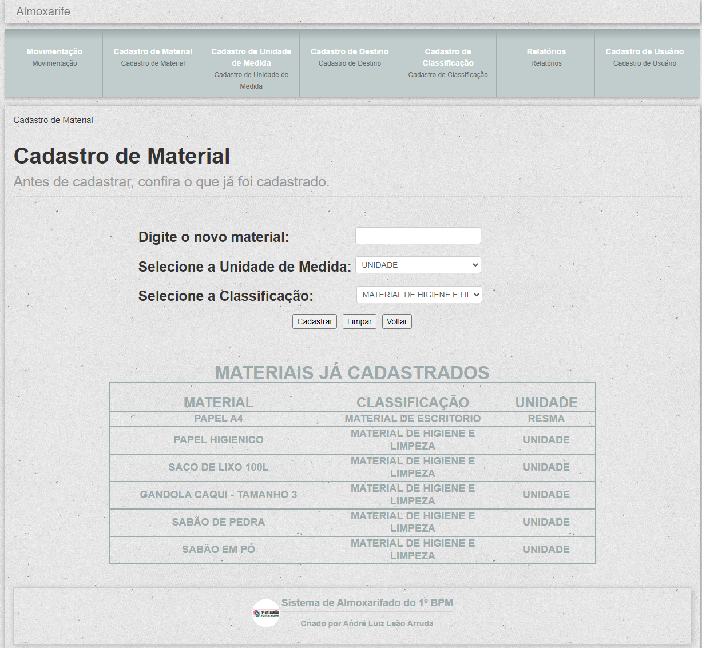
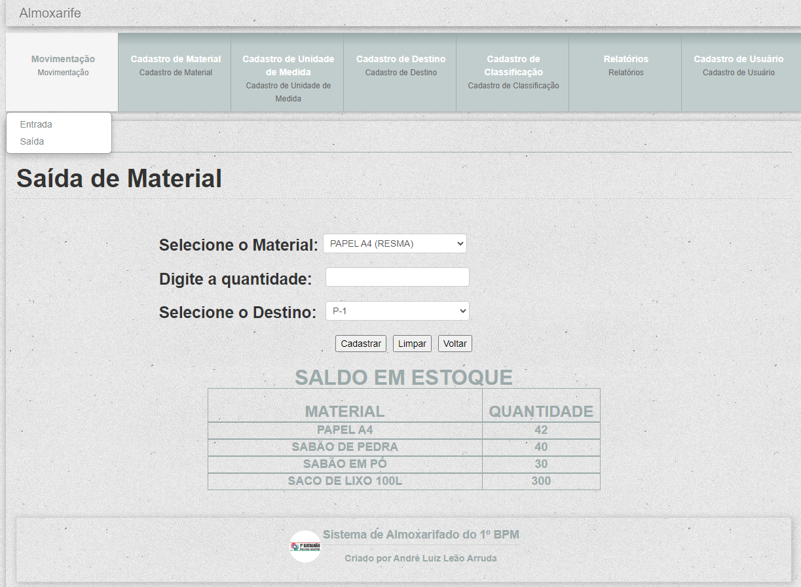
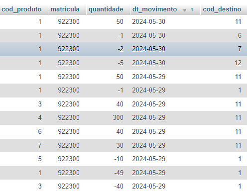
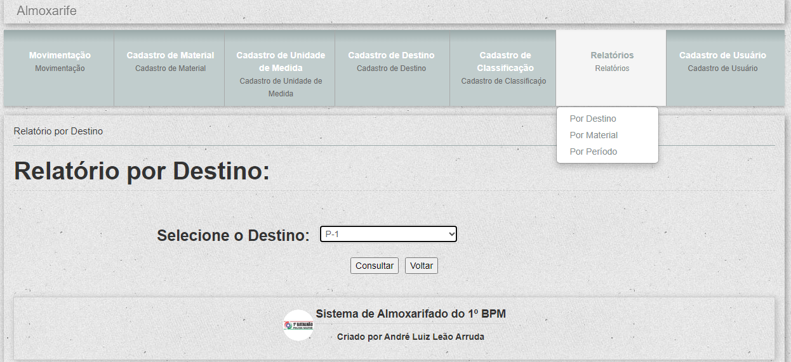
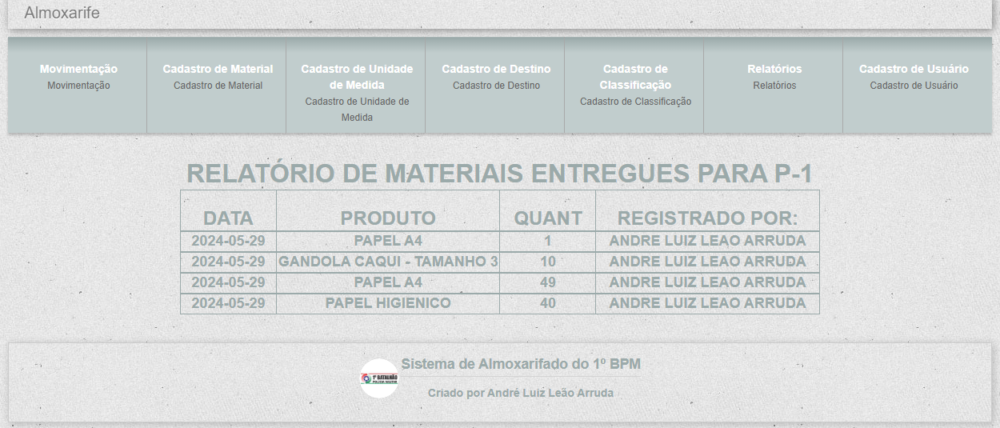
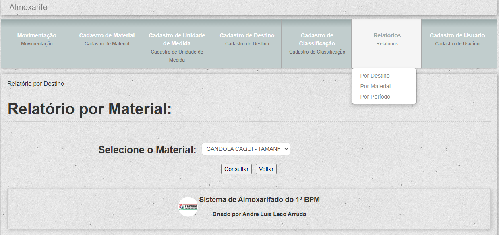
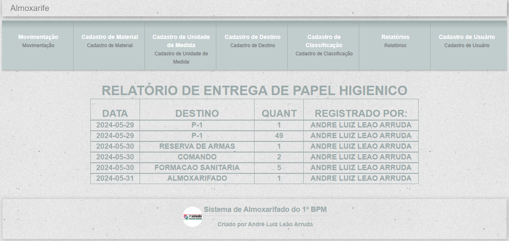
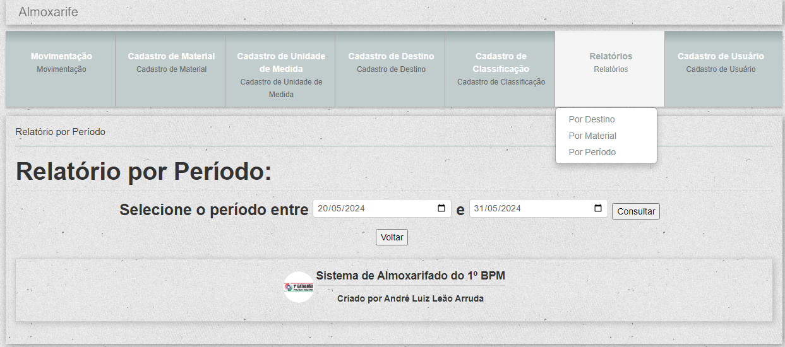
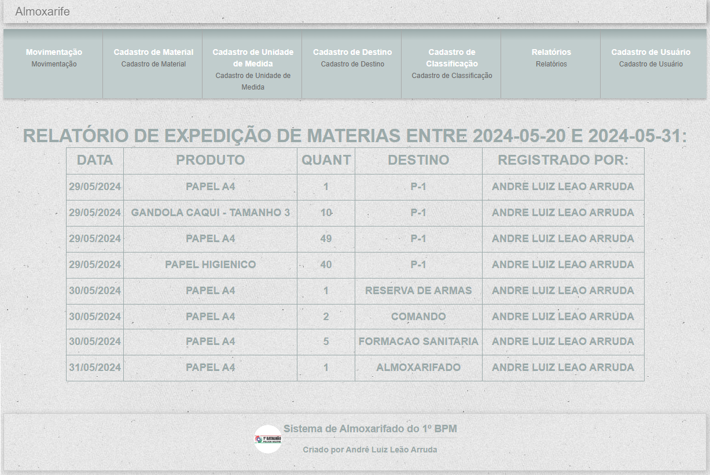

# 
 CONTROLE DE PRODUTOS DO 1º BATALHÃO DE POLÍCIA MILITAR 

  ## Este sistema, desenvolvido em PHP com MySql, consiste em registrar as entradas e saídas de mercadorias para fins de controle. 
 

### Esta é a tela principal.   O sistema é relativamente simples e tem as opções de cadastros de classificação, de destino, de unidade de medida, de material e de usuários, além dos Relatórios.   Para cadastrar o material, é preciso cadastrar antes a unidade de medida e a classificação, caso ainda não tenham sido cadastrados. E na opção Movimentação, fazem-se as entradas e saídas das mercadorias.</h3>
  > Nesta tela há, também, a opção de fazer um backup do banco de dados. O arquivo gerado irá para a pasta downloads.
     

### Clicando em Movimentação, submenu Entrada, o usuário seleciona o produto que deseja cadastrar e na segunda caixa de texto ele digita a quantidade do produto escolhido.
    Neste campo existe uma máscara que permite a digitação apenas de números.
### Abaixo da opção de cadastro, já aparecem os produtos "disponíveis".   Isto é feito através de uma consulta ao banco de dados onde, além de somar os produtos (entrada menos saída), ele exibe apenas os produtos com saldo acima de "zero". Veja como o comando foi feito:
    SELECT produtos.descricao AS 'descricao', sum(estoque.quantidade) AS 'saldo' FROM estoque, produtos 
    WHERE (produtos.cod_produto=estoque.cod_produto) 
    GROUP BY descricao HAVING sum(estoque.quantidade) > '0'
  #### Este comando, se usado sem a opção *"GROUP BY"*, vai somar todos os produtos em um único valor.   E a opção *"HAVING sum(estoque.quantidade) > '0'"* é usada para ocultar os produtos que não têm no estoque.

### Caso o produto ainda não esteja cadastrado, o usuário precisa clicar na opção Cadastro de Material. Abaixo da opção de cadastro, aparecem os produtos já cadastrados.   As opções de Unidade de Medida e Classificação são, também, previamente cadastrados, sendo assim, caso não apareçam na caixa dropdown, basta clicar nos botões Cadastro de Unidade de Medida e/ou Cadastro de Classificação, respectivamente.   Naquelas telas aparecerão, também, as opções já cadastradas. 

### Na opção Cadastro de Destino, são cadastros todos os setores que podem retirar produtos no almoxarifado.   Assim como nas outras opções de cadastros, abaixo do botão de cadastro aparece uma tabela com os destinos já cadastrados.

### Clicando em Movimentação, submenu Saída, o usuário seleciona o produto que deseja repassar.   Na segunda caixa de texto ele digita a quantidade do produto escolhido e terceira caixa ele seleciona o destino deste produto.
  > O comando de inserção na tabela "estoque" é identico ao comando usado na entrada.   As únicas diferenças é que no comando de entrada, o destino é fixo (11-Almoxarifado) e no comando de saída, a variável que captura a quantidade é convertido para valor negativo.

> 

### Pra finalizar, chegamos ao botão Relatórios, onde possui três opções prontas (podendo ser adicionadas mais opções, conforme a necessidade).
 

### A primeira opção, "Por Destino", é utilizada para verificar todos os materias entregues para determinado setor.

  > Exemplo do resultado de um Relatório por Destino.

 

### A segunda opção, "Por Material", é utilizada para verificar determinado material entregue a todos os setores.

  > Exemplo do resultado de um Relatório por Material.

 

### A terceira opção, "Por Período", é utilizada para verificar todos os materiais entregue a todos os setores por um determinado período.
  > Nos campos a preencher, foi criada uma regra para não deixar avançar se não preencher os dois campos
  >  e outra regra para comparar se o segundo campo está com data menor que o primeiro, bloqueando também.

  > Exemplo do resultado de um Relatório por Período.
