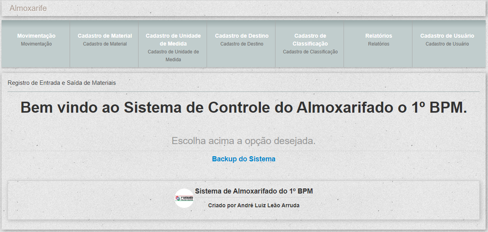

# 
 CONTROLE DE PRODUTOS DO 1º BATALHÃO DE POLÍCIA MILITAR 

  ## Este sistema, desenvolvido em PHP com MySql, consiste em registrar as entradas e saídas de mercadorias para fins de controle. 
 

### Esta é a tela principal.   O sistema é relativamente simples e tem as opções de cadastros de classificação, de destino, de unidade de medida e de material, além dos Relatórios e do cadastro de usuário. Para cadastrar o material, é preciso cadastrar antes a unidade de medida e a classificação, caso ainda não tenham sido cadastrados. E na opção Movimentação, fazem-se as entradas e saídas das mercadorias.</h3>
