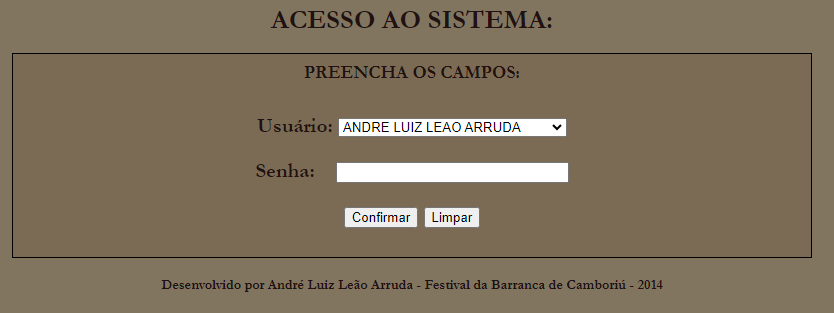

<html>
<body><h2 align=center> FESTIVAL DA BARRANCA DE CAMBORIÚ </h2>
  <h3 align=justify> Este sistema, desenvolvido em PHP com MySql, consiste em registrar as notas de três jurados para apresentações em um concurso de música tradicionalista gaúcha. </h3>
  <h3 align=center></h3>
  <h3 align=center></h3>
  <h3 align=justify>Nesta primeira tela, temos o acesso dos usuários já cadastrados, classificados como Administrador, Jurado e Usuário Padrao.</h3>
  <h3 align=center></h3>
  <h3 align=justify> Na segunda tela aparecem todos os acessos do Administrador, vamos detalhar um por um. </h3>
  <h3 align=center></h3>
  <h3 align=justify>Aqui cadastram-se todos os artistas que participarão das apresentações. Percebe-se que caso seja necessário fazer alguma alteração ou exclusão dos dados de alguém que já foi cadastrado, isto pode ser feito através dos botões da coluna AÇÕES.</h3>
  <h3 align=center></h3>
  <h3 align=justify>Após cadastrado o artista, é possível cadastrar a sua música e demais participantes. Os campos Gênero (Musical) e Instrumento(s) já estão pré-cadastrados, mas caso seja necessário, podem ser adicionados novos itens.</h3>
  <h3 align=center></h3>
  <h3 align=justify> Da mesma forma em que são cadastradas as música, são cadastrados os poemas. </h3>
  <h3 align=center></h3>
  <h3 align=justify>Na tela Cadastro de Usuário, é possível cadastrar as pessoas que podem ter acesso ao sistema. Como já mencionado anteriormente, é no campo Nível de Acesso que se escolhe a função do cadastrado.</h3>
  <h3 align=center></h3>
  <h3 align=justify>Nesta tela, é possível excluir qualquer usuário (menos a sua própria conta).
  <h3 align=center></h3>
  <h3 align=justify>Ao clicar em sortear música, o sistema faz um sorteio automático de todas as músicas, para fins de apresentação. Na tela em questão, como já foi feito o sorteio (através do comando MySQL "order by rand()"), sendo assim, a ordem das apresentações já foi fixada, e é informada a mensagem "SORTEIO JÁ EFETUADO!".</h3>
  <h3 align=center></h3>
  <h3 align=justify>O mesmo aconteceu com o sorteio das poesias.</h3>
  <h3 align=center></h3>
  <h3 align=justify>As telas CONSULTAR MÚSICAS e CONSULTAR POEMAS são, na minha opinião, o melhor de todo o sistema, pois elas são os painéis do que está acontecendo no festival. 
A coluna ORDEM DE SORTEIO exibe as música ordenadas pelo sorteio, a coluna NOME DA MÚSICA já se explica por si, a coluna CÓDIGO DE CADASTRO exibe a ordem em que as músicas foram inseridas no sistema, o que comprova que houve um sorteio aleatório e não está na ordem de inserção no sistema. 
A coluna QUANTIDADE DE NOTAS exibe a quantidade de jurados que já concluíram seu voto para determinada música. 
A coluna STATUS indica qual música está sendo apresentada naquele momento. Nesta coluna podem aparecer três opções: 1. AGUARDANDO LIBERAÇÃO, 2. EM VOTAÇÃO e 3. VOTAÇÃO CONCLUÍDA.   Após o sorteio aleatório, a primeira música já passa seu status para "EM VOTAÇÃO" e as demais músicas passam para "AGUARDANDO LIBERAÇÃO". Quando o terceiro jurado concluir sua votação, a primeira música aparecerá com o status "VOTAÇÃO CONCLUÍDA", a segunda música aparecerá com status "EM VOTAÇÃO" e as demais permanecerão com o status "AGUARDANDO LIBERAÇÃO" até chegar a vez de cada uma.   Para que a tela se atualize automaticamente, foi incluído o seguinte comando em PHP 'header("refresh: 3;")', desta forma, a tela é atualizada a cada três segundos. </h3>
  <h3 align=center></h3>
  <h3 align=justify>O mesmo acontece com a tela CONSULTAR POESIAS. Neste caso os jurados são os mesmos.</h3>
  <h3 align=center></h3>
  <h3 align=justify><b>Logo após a conclusão do voto do último jurado para a última música, já é possível acessar a opção RESULTADO FINAL: MÚSICAS (TEMA LIVRE) e divulgar o vencedor, sem perda de tempo, sem precisar ficar fazendo cálculos.</b></h3>
  <h3 align=center></h3>
  <h3 align=justify>O mesmo acontece com a consulta das POESIAS.</h3>
  <h3 align=center></h3>
  <h3 align=justify>Após concluir todas as votações, é possível imprimir, também, alguns relatórios com as pontuações recebidas pelos artista, caso queiram saber suas notas.   É também neste local que pode-se consultar o INTÉRPRETE MAIS VOTADO.</h3>
  <h3 align=center></h3>
  <h3 align=justify>A diretoria solicito, também, a possibilidade de gerar um ticket, com base na relação dos artistas cadastrados, pois estes teriam direito a janta gratuitamente no evento, o que foi incluído no sistema, na opção IMPRESSÃO DE TICKET DE JANTA.</h3>
  <h3 align=center></h3>
  <h3 align=justify>Já para o jurado, quando ele se loga no sistema, aparece esta tela, com as opções de acesso a Poesias e Músicas.</h3>
  <h3 align=center></h3>
  <h3 align=justify>Ao clicar em POESIAS, o jurado pode consultar as poesias cadastradas e abrir a tela de avaliação, caso já esteja disponível. A mesma tela aparece para as músicas.
  <h3 align=center></h3>
  <h3 align=justify>A tela a seguir apresenta os quesitos que serão avaliados pelos jurados. Os campos de nota estão bloqueados de forma que a nota não seja inferior a 5 e superior a 10, com até dois décimos permitidos.</h3>
  <h3 align=center></h3>
    <h3 align=justify> O mesmo acontece para a avaliação da poesia. </h3>
  </html>
