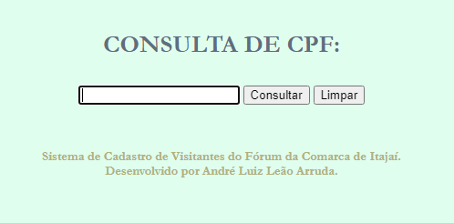
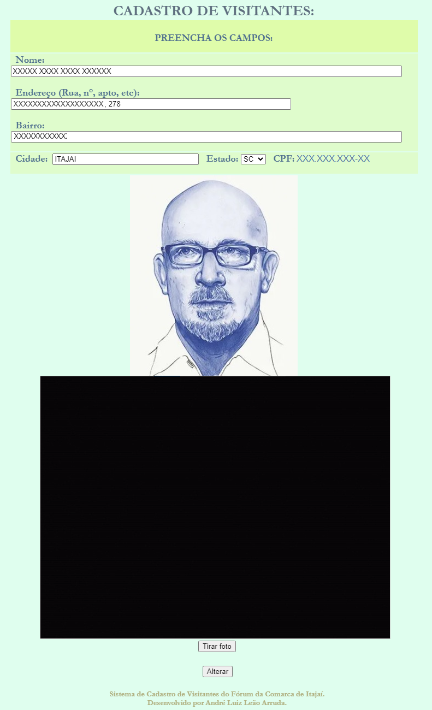
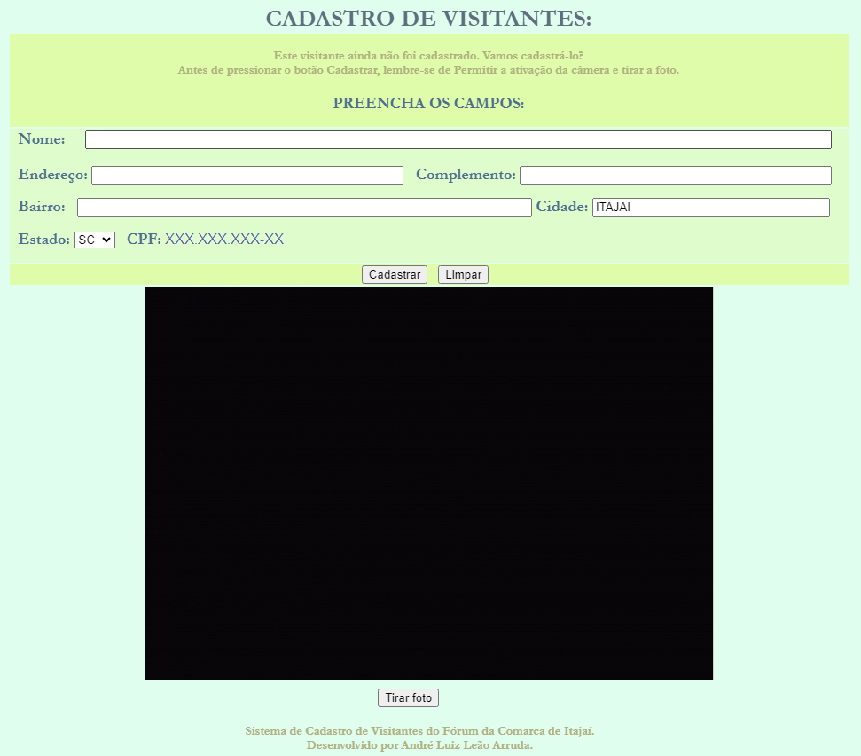
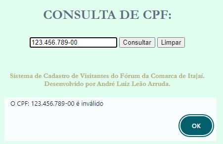

<html>
<body><h2 align=center> SISTEMA DE CADASTRO DE VISITANTES DO FÓRUM DE ITAJAÍ </h2>
  <h3 align=justify> Este sistema consiste em registrar todas as pessoas que entram no Fórum e seu destino. </h3>
    <h3 align=center></h3>
    <h3 align=justify>Para agilizar o atendimento, após o(a) recepcionista se logar (para registrar suas atividades) e solicitar o CPF do visitante, digita-o no único campo da tela inicial.  Após digitar e pressionar Enter, ou clicar em Consultar, será feita uma consulta ao banco de dados do sistema para ver se o visitante já tem cadastro.</h3>
  <h3 align=center></h3>
  <h5 align=center><b><i> O nome aparece como XXXXX XXXX XXXX XXXXXX e a foto aparece uma pintura, mas isso é apenas nesta apresentação, respeitando a Lei Geral Proteção de Dados. </i></b></h5>
    <h3 align=justify>Caso o visitante já tenha cadastro, aparecerá na próxima tela seu nome, sua foto e uma caixa em <i>dropdown</i> com os destinos pré-cadastrados. Note que o sistema já captura e exibe a data e a hora atuais, do servidor, (dispensado o(a) recepcionista de ter que digitar ou cadastrar tais informações).</h3>
    <h3 align=center></h3>
    <h3 align=justify> Após escolher o destino, o(a) recepcionista clica em REGISTRAR ENTRADA, o sistema registra tal entrada e exibe uma tela de confirmação juntamente com a opção de retornar para a tela principal.</h3>
    <h3 align=center></h3>  
    <h3 align=justify> Ainda, na tela onde aparece o nome e a foto do visitante, existe a opção "Alterar Cadastro", onde pode ser atualizado o endereço do visitante, caso ele informe que houve mudança, corrigir o nome e até mesmo alterar a foto (mais comum entre as mulheres, que podem mudar a cor dos cabelos, por exemplo), após a atualização dos dados, clicando em Alterar, o sistema volta para a tela de cadastro do destino.</h3>   
    <h3 align=center></h3>  
    <h3 align=justify> Caso o visitante não tenha cadastro, aparecerá uma tela para o preenchimento desses dados, já com o campo do CPF, digitado na tela anterior, preenchido no respectivo campo. Além disso, no campo cidade e Estado, já estão preenchidos Itajaí e Santa Catarina, mas, ainda, com a possibilidade de trocar para outros Estados e cidades, apenas para agilizar o cadastro, considerando que a maioria dos cadastrados são de Itajaí.   Poderia incluir-se a opção telefone, mas na época os responsáveis dispensaram, considerando que naquele momento não tinha importância e tomaria mais tempo de preenchimento. Mas caso seja necessário, é de fácil implementação. </h3>
    <h3 align=center></h3>  
    <h3 align=justify> O campo de digitação do CPF possui algumas travas do tipo: aceita somente número, os pontos e traço são adicionados automaticamente (máscara) e validação de CPF, ajudando a corrigir caso o(a) recepcionista tenha digitado algum número errado. </h3>

</html>

