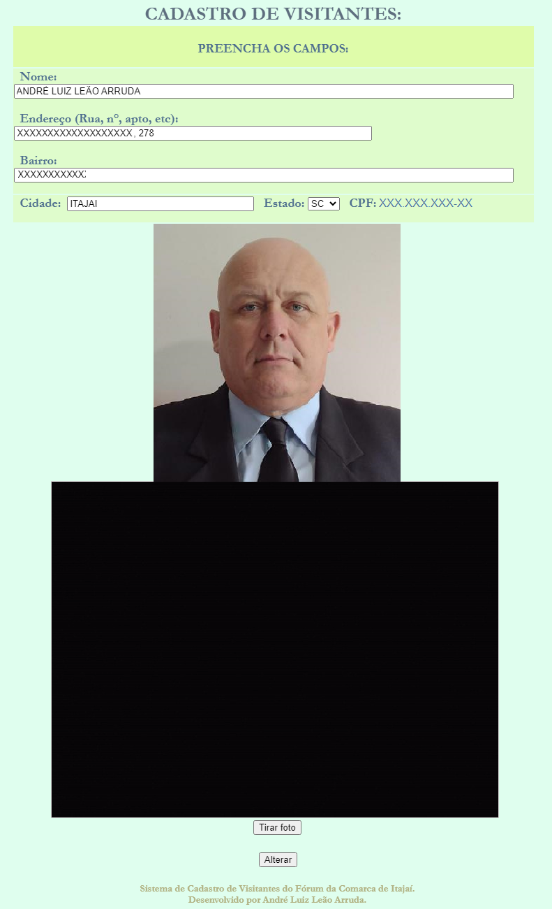
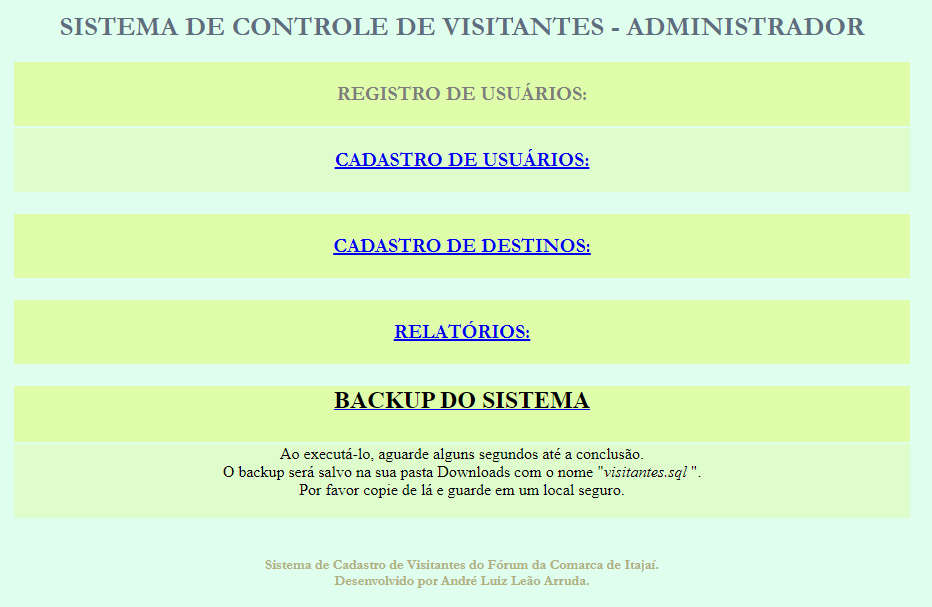
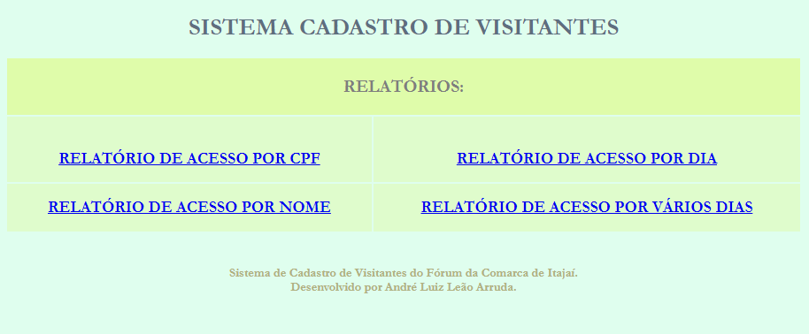

<html>
<body><h2 align=center> SISTEMA DE CADASTRO DE VISITANTES DO FÓRUM DE ITAJAÍ </h2>
  <h3 align=justify> Este sistema desenvolvido em PHP com MySql e que consiste em registrar todas as pessoas que entram no Fórum, seu destino, data e hora de entrada. </h3>
    <h3 align=justify>Para agilizar o atendimento, após o(a) recepcionista se logar (para registrar suas atividades) e solicitar o CPF do visitante, digita-o no único campo da tela inicial.  Após digitar e pressionar Enter, ou clicar em Consultar, será feita uma consulta ao banco de dados do sistema para ver se o visitante já tem cadastro.</h3>
  <h3 align=center></h3>
  <h3 align=justify>Caso o visitante já tenha cadastro, aparecerá na próxima tela seu nome, sua foto e uma caixa em <i>dropdown</i> com os destinos pré-cadastrados. Note que o sistema já captura e exibe a data e a hora atuais, do servidor, (dispensado o(a) recepcionista de ter que digitar ou cadastrar tais informações).</h3>
    <h3 align=center></h3>
    <h3 align=justify> Após escolher o destino, o(a) recepcionista clica em REGISTRAR ENTRADA, o sistema registra tal entrada e exibe uma tela de confirmação juntamente com a opção de retornar para a tela principal.</h3>
    <h3 align=center></h3>  
    <h3 align=justify> Ainda, na tela onde aparece o nome e a foto do visitante, existe a opção "Alterar Cadastro", onde pode ser atualizado o endereço do visitante, caso ele informe que houve mudança, corrigir o nome e até mesmo alterar a foto (mais comum entre as mulheres, que podem mudar a cor dos cabelos, por exemplo), após a atualização dos dados, clicando em Alterar, o sistema volta para a tela de cadastro do destino.</h3>   
    <h3 align=center></h3>  
    <h3 align=justify> Caso o visitante não tenha cadastro, aparecerá uma tela para o preenchimento desses dados, já com o campo do CPF, digitado na tela anterior, preenchido no respectivo campo. Além disso, no campo cidade e Estado, já estão preenchidos Itajaí e Santa Catarina, mas, ainda, com a possibilidade de trocar para outros Estados e cidades, apenas para agilizar o cadastro, considerando que a maioria dos cadastrados são de Itajaí. 
 Poderia incluir-se a opção telefone, mas na época os responsáveis dispensaram na intenção de ganhar tempo. Mas caso seja necessário, é de fácil implementação.

    
 Todos os campos são de preenchimento obrigatório e após tudo preenchido, ao pressionar o botão Cadastrar, aparecem novamente todos os dados preenchidos para que o(a) recepciona confirme pela segunda vez para só depois cadastrar no banco de dados.

    
 Ao concluir o cadastro, o sistema já direciona para a tela de destino, com os dados que acabaram de ser cadastrados já aparecendo na tela, evitando a necessidade de ter que digitar o CPF novamente.

    </h3>
    <h3 align=center></h3>  
    <h3 align=justify> O campo de digitação do CPF possui algumas travas do tipo: aceita somente números, os pontos e traço são adicionados automaticamente (máscara) e validação de CPF, ajudando a corrigir caso o(a) recepcionista tenha digitado algum número errado. </h3>
    <h3 align=center></h3>
    <h3 align=justify> Existe, também, um acesso especial para o(a) administrador(a), onde ao logar-se no sistema, apresenta uma tela diferente, que possibilita Cadastro de Usuários, Cadastro de Destinos, Relatórios e Backup do Sistema (que é feito com apenas um clique).</h3>
    <h3 align=center></h3>
    <h3 align=justify> Na tela de Relatórios, têm opções de pesquisas por CPF, por Nome, para um dia ou para vários dias.  Caso os responsáveis necessitem de um novo formato de pesquisa, ele será desenvolvido facilmente.</h3>
    <h3 align=center></h3>
</html>

